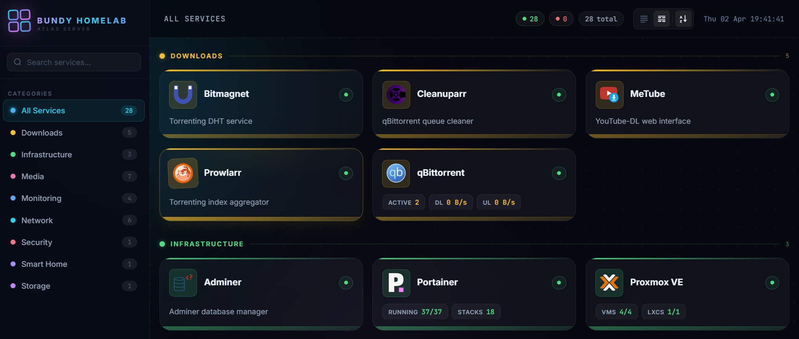

# LabDash

A clean, fast, self-hosted homelab dashboard. Monitor all your services at a glance with real-time status checks and live stats pulled directly from each service's API.



> **Security notice:** LabDash is designed for use on your **internal/local network only**. The `services.yaml` configuration file contains API keys, usernames, and passwords in plain text. Do not expose this dashboard to the public internet.

---

## Features

- **Live status indicators** — every service is polled on a configurable interval and shown as Online, Offline, or Checking
- **Live stats** — 18 supported services expose real-time data directly on their card (media counts, CPU/RAM, torrent speeds, DNS stats, and more)
- **Emoji stat chips** — optionally replace stat label text with emojis, globally or per service
- **Per-service refresh rates** — fast-changing services like Glances can refresh every 5 seconds while slower ones like Immich refresh every 5 minutes
- **Category grouping** — services are colour-coded and grouped by category with a filterable sidebar
- **Search** — filter services by name, category, or description in real time
- **Scrollable stat chips** — stats sit on a single draggable/swipeable row at the bottom of each card
- **Flat or grouped view** — toggle between a single grid or sections grouped by category
- **Custom logos** — drop your own SVG/PNG logos into `config/logos/`
- **Icons-only mode** — hide service names and show only icons for a compact layout
- **Hide descriptions** — strip description text from all cards for a cleaner look
- **Docker-first** — single container, one config file, done

---

## Quick Start

```bash
# 1. Clone the repo
git clone https://github.com/BuzzMoody/LabDash.git
cd LabDash

# 2. Start the container
docker compose up -d

# 3. Open the dashboard
# http://localhost:6969
```

On first run an example `services.yaml` is automatically created at `./config/services.yaml`. Edit it to add your services, then restart:

```bash
docker compose restart
```

### Pulling from the container registry

```yaml
services:
  labdash:
    image: ghcr.io/buzzmoody/labdash:latest
    container_name: LabDash
    ports:
      - "6969:6969"
    volumes:
      - ./config:/config
    restart: unless-stopped
```

---

## Configuration

All configuration lives in a single YAML file at `./config/services.yaml`.

### Global Settings

```yaml
settings:
  title: "My Homelab"         # dashboard title (displayed top-left)
  subtitle: "Home Server"     # subtitle line below the title
  refresh_interval: 30        # default seconds between service refreshes
  emoji_stats: true           # show emoji instead of text labels on all stat chips
  icons_only: true            # hide service names — show icons only
  hide_descriptions: true     # hide description text on all cards
```

All settings are optional. `emoji_stats`, `icons_only`, and `hide_descriptions` default to `false`.

### Service Fields

| Field | Required | Description |
|---|---|---|
| `name` | Yes | Display name for the service |
| `url` | Yes | URL opened when the card is clicked |
| `category` | No | Groups the service and applies a colour |
| `description` | No | Short description shown on the card |
| `icon` | No | Emoji used when no logo is set |
| `logo` | No | Filename of an image in `config/logos/` |
| `endpoint` | No | Override URL used for status checks and API calls (useful when the API lives at a different path than the UI) |
| `api_type` | No | Enables live stats for supported services (see below) |
| `api_key` | No | API key or token for authenticated services |
| `username` | No | Username for services that use login-based auth |
| `password` | No | Password for services that use login-based auth |
| `args` | No | Comma-separated list of stat keys to display (see Live Services) |
| `refresh` | No | Per-service refresh interval in seconds, overrides the global setting |
| `emoji_stats` | No | Show emoji instead of text labels on this service's stat chips |

### Minimal service example

```yaml
- name: My Service
  url: "http://192.168.1.10:8080"
  category: Infrastructure
  icon: "⚙️"
  description: "Does a thing"
```

### Full service example

```yaml
- name: Jellyfin
  url: "http://192.168.1.10:8096"
  category: Media
  logo: jellyfin.svg
  icon: "🎦"
  description: "Open-source media server"
  api_type: jellyfin
  api_key: "your-jellyfin-api-key"
  args: "movies, series, episodes"
  refresh: 300
  emoji_stats: true
```

---

## Categories & Colours

Categories are defined by the `category:` field on each service. The name is case-insensitive. Services without a category are grouped under **Other**.

The default view is grouped by category. Categories are sorted alphabetically in the sidebar and in the grouped grid view.

| Category | Colour |
|---|---|
| Media | Pink `#f472b6` |
| Downloads | Amber `#fbbf24` |
| Infrastructure | Green `#4ade80` |
| Network | Cyan `#22d3ee` |
| Storage | Purple `#c084fc` |
| Monitoring | Blue `#60a5fa` |
| Smart Home | Violet `#a78bfa` |
| Security | Rose `#fb7185` |
| *(anything else)* | Slate `#94a3b8` |

Any category name you use that isn't in the list above will display in slate grey. The colour is applied to the card accent bar, stat chip values, category badge, and sidebar indicator.

---

## Filtering & Views

### Sidebar — Category Filter

Click any category in the left sidebar to show only services in that group. Click **All Services** to return to the full view.

### Search

Type in the search bar (top of the sidebar) to filter services by name, category, or description. The filter is applied in real time.

### Status Pills

The topbar shows three clickable pills:

- **Online** — click to show only services currently reachable
- **Offline** — click to show only services that failed their status check
- **Total** — click to clear the status filter

Clicking an active pill a second time clears that filter.

### Flat vs Grouped View

The two icons in the top-right of the topbar toggle between:

- **Grouped** *(default)* — services separated into category sections with colour-coded headings
- **Flat** — all services in a single grid regardless of category

Your preference is saved in `localStorage` and persists across page loads.

---

## Live Services

Services with an `api_type` display live data chips at the bottom of their card. Stats are fetched on the same schedule as the status check (or their own `refresh:` interval if set).

### Controlling which stats appear

The `args:` field is a comma-separated list of stat keys. Only the keys you list will appear on the card. **If `args:` is omitted, no stats are shown at all.**

```yaml
args: "movies, series"        # show two chips
args: "cpu, ram, swap, load"  # show four chips
args: "version"               # show one chip
```

Stats appear in the order you list them and are displayed on a horizontally scrollable row — you can drag or swipe to see more if they overflow the card width.

### Emoji stat chips

When `emoji_stats: true` is set (globally in `settings:` or on an individual service), stat chips display an emoji instead of a text label. Hovering over a chip shows the original label as a tooltip.

```yaml
# Global — all services use emoji chips
settings:
  emoji_stats: true

# Per-service — only this service uses emoji chips
- name: Proxmox VE
  emoji_stats: true
  ...
```

Per-service `emoji_stats` takes precedence over the global setting.

### Per-service refresh rate

By default every service refreshes on the global `refresh_interval`. You can override this per service with the `refresh:` field (in seconds):

```yaml
refresh: 5     # update every 5 seconds (e.g. Glances, qBittorrent)
refresh: 300   # update every 5 minutes (e.g. Immich, Jellyfin)
refresh: 3600  # update once an hour
```

---

## Supported Live Services

### Jellyfin
```yaml
api_type: jellyfin
api_key: "your-api-key"
```
| Arg | Description |
|---|---|
| `movies` | Total movie count |
| `series` | Total series count |
| `episodes` | Total episode count |

---

### Emby
```yaml
api_type: emby
api_key: "your-api-key"
```
| Arg | Description |
|---|---|
| `movies` | Total movie count |
| `series` | Total series count |
| `episodes` | Total episode count |

---

### Sonarr
```yaml
api_type: sonarr
api_key: "your-api-key"
```
| Arg | Description |
|---|---|
| `series` | Total series count |
| `monitored` | Number of monitored series |

---

### Radarr
```yaml
api_type: radarr
api_key: "your-api-key"
```
| Arg | Description |
|---|---|
| `movies` | Total movie count |
| `downloaded` | Number of movies with a file on disk |

---

### qBittorrent
```yaml
api_type: qbittorrent
# No api_key required — uses session cookie auth
```
| Arg | Description |
|---|---|
| `active` | Number of active torrents |
| `dl` | Current download speed |
| `ul` | Current upload speed |

---

### Immich
```yaml
api_type: immich
api_key: "your-api-key"
```
| Arg | Description |
|---|---|
| `photos` | Total photo count |
| `videos` | Total video count |
| `usage` | Total storage used (auto-scaled, e.g. `54.7 GB`) |

---

### Proxmox VE
```yaml
api_type: proxmox
api_key: "PVEAPIToken=user@pam!token=xxxxxxxx-xxxx-xxxx-xxxx-xxxxxxxxxxxx"
```
| Arg | Description |
|---|---|
| `vms` | Running/total QEMU virtual machines |
| `lxcs` | Running/total LXC containers |

---

### Portainer
```yaml
api_type: portainer
api_key: "your-portainer-api-key"
```
| Arg | Description |
|---|---|
| `endpoints` | Total number of endpoints |
| `running` | Running/total containers across all endpoints |
| `stacks` | Total stack count |

---

### Glances
```yaml
api_type: glances
# No api_key required
refresh: 5   # recommended — Glances data changes fast
```
| Arg | Description |
|---|---|
| `cpu` | CPU usage percentage |
| `ram` | RAM usage percentage |
| `swap` | Swap usage percentage |
| `load` | System load average |

---

### Grafana
```yaml
api_type: grafana
api_key: "your-service-account-token"
```
| Arg | Description |
|---|---|
| `dashboards` | Total dashboard count |
| `sources` | Total data source count |

---

### Pi-hole *(v6)*
```yaml
api_type: pihole
api_key: "your-app-password"
```
| Arg | Description |
|---|---|
| `total` | Total DNS queries today |
| `blocked` | Total blocked queries today |
| `percent_blocked` | Percentage of queries blocked |
| `frequency` | Query rate (queries/second) |

> Pi-hole v6 uses App Passwords. Generate one in the Pi-hole web UI under **Settings → API**.

---

### AdGuard Home
```yaml
api_type: adguard
api_key: "username:password"
```
| Arg | Description |
|---|---|
| `blocked` | Percentage of queries blocked |
| `queries` | Total DNS queries today |

---

### Nextcloud
```yaml
api_type: nextcloud
api_key: "username:app-password"
```
| Arg | Description |
|---|---|
| `files` | Total file count |
| `users` | Total user count |
| `php` | PHP version running on the server |

---

### Home Assistant
```yaml
api_type: homeassistant
api_key: "your-long-lived-access-token"
```
| Arg | Description |
|---|---|
| `entities` | Total entity count |
| `active` | Number of entities with state `on` |

---

### Vaultwarden
```yaml
api_type: vaultwarden
# No api_key required
```
| Arg | Description |
|---|---|
| `version` | Current Vaultwarden version |

---

### Nginx Proxy Manager
```yaml
api_type: nginxproxymanager
username: "your-email@example.com"
password: "your-password"
```
| Arg | Description |
|---|---|
| `proxy` | Number of proxy hosts |
| `redirection` | Number of redirection hosts |
| `stream` | Number of stream hosts |
| `dead` | Number of dead/disabled hosts |
| `certs` | Total SSL certificate count |
| `version` | Current NPM version (appends `↑` if an update is available) |

---

### Dispatcharr
```yaml
api_type: dispatcharr
username: "your-username"
password: "your-password"
```
| Arg | Description |
|---|---|
| `channels` | Total IPTV channel count |

---

### Speedtest Tracker
```yaml
api_type: speedtesttracker
api_key: "your-api-key"   # optional
```
| Arg | Description |
|---|---|
| `ping` | Ping from the most recent test (ms) |
| `download` | Download speed from the most recent test (Mbps) |
| `upload` | Upload speed from the most recent test (Mbps) |

> Returns no stats if the most recent test is marked as failed.

---

## Adding Your Own API Manager

LabDash is designed so that adding support for a new service only requires creating a single file. No other files need to be modified.

### 1. Create the handler file

Add a new file to `api-managers/` named after your service (lowercase, no spaces):

```
api-managers/myservice.js
```

### 2. Write the handler function

The function must be a named export following the pattern `api_<name>`. It receives three arguments:

- `svc` — the full service object from `services.yaml` (gives you access to `svc.url`, `svc.api_key`, `svc.args`, etc.)
- `timedFetch` — a pre-configured `fetch` wrapper that applies a timeout. Use this instead of `fetch` directly.
- `utils` — helper functions: `utils.fmtNum(n)` (locale-formatted number) and `utils.fmtBytes(b)` (auto-scaled bytes string)

The function must return an array of stat objects, or `null` if the fetch fails.

Each stat object has:

| Field | Required | Description |
|---|---|---|
| `label` | Yes | The text label shown on the chip (also used as the tooltip when `emoji_stats` is on) |
| `value` | Yes | The value shown on the chip — always convert to a string or number |
| `emoji` | No | Emoji shown instead of the label when `emoji_stats` is enabled |

```js
export async function api_myservice(svc, timedFetch, utils) {
    const args = (svc.args ?? '').split(',').map(a => a.trim().toLowerCase()).filter(Boolean);
    if (!args.length) return null;

    try {
        const base    = (svc.endpoint ?? svc.url).replace(/\/$/, '');
        const headers = svc.api_key ? { 'Authorization': `Bearer ${svc.api_key}` } : {};
        const res     = await timedFetch(`${base}/api/stats`, { headers });
        if (!res.ok) return null;

        const data = await res.json();

        const available = {
            users:  () => ({ label: 'Users',  value: utils.fmtNum(data.userCount),  emoji: '👤' }),
            uptime: () => ({ label: 'Uptime', value: `${data.uptimeDays}d`,          emoji: '⏱️' }),
        };

        return args.map(a => available[a]?.()).filter(Boolean);
    } catch { return null; }
}
```

### 3. Register the handler

Open `api-managers/index.js` and add your handler to the imports and the `API_HANDLERS` map:

```js
import { api_myservice } from './myservice.js';

export const API_HANDLERS = {
    // ... existing handlers ...
    myservice: api_myservice,
};
```

### 4. Use it in services.yaml

```yaml
- name: My Service
  url: "http://192.168.1.10:1234"
  category: Infrastructure
  api_type: myservice
  api_key: "your-api-key"
  args: "users, uptime"
```

That's it — no changes needed anywhere else. The `emoji_stats` feature works automatically for any stat that includes an `emoji` field.

---

## Logos

### Where to get icons

**[Dashboard Icons](https://dashboardicons.com/)** is the recommended source for service logos. It provides a large, actively maintained library of high-quality SVG icons for virtually every self-hosted application. Search for your service, download the SVG, and drop it straight into your config directory. SVG format is preferred as it scales perfectly at any size.

### Where to put them

Place your logo files in `./config/logos/` — the same directory as your `services.yaml`:

```
config/
├── services.yaml
└── logos/
    ├── jellyfin.svg
    ├── sonarr.svg
    ├── radarr.svg
    └── ...
```

### How to reference them

Add the `logo:` field to your service entry with just the filename (no path needed):

```yaml
- name: Jellyfin
  url: "http://192.168.1.10:8096"
  logo: jellyfin.svg
  icon: "🎦"           # fallback if logo fails to load
```

Both `.svg` and `.png` are supported. If `logo:` is not set, the `icon:` emoji is used as a fallback. If neither is set, a default ⚙️ is shown.

---

## Security

- LabDash is intended for **local network use only**
- `services.yaml` stores API keys, usernames, and passwords **in plain text** — keep this file private and do not expose it or the dashboard to the internet
- Some integrations (Nginx Proxy Manager, Dispatcharr, Pi-hole v6) exchange credentials for a session token on each restart; the token is cached in memory only and never written to disk
- There is no built-in authentication on the dashboard itself — if you need to access it remotely, place it behind a VPN or an authenticated reverse proxy

---

## Project Structure

```
LabDash/
├── api-managers/          # One file per supported service integration
│   ├── index.js           # Registers all API handlers
│   ├── jellyfin.js
│   ├── proxmox.js
│   └── ...
├── js/                    # Frontend ES modules
│   ├── config.js          # Global config constants
│   ├── state.js           # Shared runtime state
│   ├── services.js        # Service loading, polling, and refresh logic
│   ├── render.js          # Card and grid rendering
│   ├── ui.js              # Sidebar, search, filters, and view toggles
│   ├── stats.js           # Stat chip scroll/drag behaviour
│   ├── utils.js           # Shared helpers (formatting, fetch, chips)
│   ├── counters.js        # Online/offline/total counters
│   └── updates.js         # Update checker and changelog modal
├── config/                # Mounted volume — your config lives here
│   ├── services.yaml      # Your service definitions
│   └── logos/             # Your custom logo images
├── app.js                 # Entry point — wires up all modules
├── styles.css             # All styles
├── index.html             # Dashboard shell and template
├── main.go                # Go HTTP server — serves assets and proxies status checks
├── docker-compose.yml
└── VERSION                # Current version number
```

---

*Made by Buzz — built for homelabbers, by a homelabber.*
